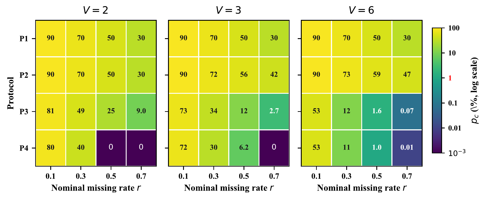

# imvc-audit

Protocol statistics and observation-mask analysis for incomplete multi-view clustering.

[](https://arxiv.org/abs/2606.04857)
[](LICENSE)

[Quick Start](#quick-start) · [Python API](#python-api) · [Citation](#citation) · [CRAFT Model](https://github.com/dk23lhl/CRAFT)

## Paper

**Beyond Missing Rates: Rethinking Incomplete Multi-View Clustering with Protocol Divergence**

Haolu Liu, Xiyue Wang, Xuanting Xie, Liangjian Wen, Zhao Kang

**NeurIPS 2026 · Poster** · [Paper](https://arxiv.org/abs/2606.04857)

The toolkit reports `r_hat` (effective cell missing rate) and `p_c` (complete-sample proportion).

[](docs/assets/protocol_pc.png)

## Quick Start

Install from GitHub:

```bash
python -m pip install "git+https://github.com/dk23lhl/imvc-audit.git"
```

Compare protocol formulas for six views at nominal missing rate 0.5:

```bash
imvc-audit --V 6 --rates 0.5
```

```text
V=6
            r=0.5
Proto    r_hat      p_c
P1       0.083    0.500
P2       0.083    0.590
P3       0.497    0.016
P4       0.500    0.010
```

## Python API

Generate a mask and compute its statistics:

```python
import numpy as np
from imvc_audit import empirical_stats, generate_mask

mask = generate_mask(
    n=5000, V=6, r=0.5, protocol="P4",
    rng=np.random.default_rng(0),
)
print(empirical_stats(mask))
```

A mask has shape `(samples, views)`, with `True` for observed views and `False` for missing views. Use `empirical_stats(mask)` to analyze your own mask.

## Citation

```bibtex
@inproceedings{liu2026beyond,
  title     = {Beyond Missing Rates: Rethinking Incomplete Multi-View Clustering with Protocol Divergence},
  author    = {Liu, Haolu and Wang, Xiyue and Xie, Xuanting and Wen, Liangjian and Kang, Zhao},
  booktitle = {Advances in Neural Information Processing Systems},
  year      = {2026},
  note      = {Accepted as a poster paper},
  url       = {https://arxiv.org/abs/2606.04857}
}
```

## License and Contact

[MIT License](LICENSE) · [GitHub Issues](https://github.com/dk23lhl/imvc-audit/issues) · [Zhao Kang](mailto:zkang@uestc.edu.cn)
